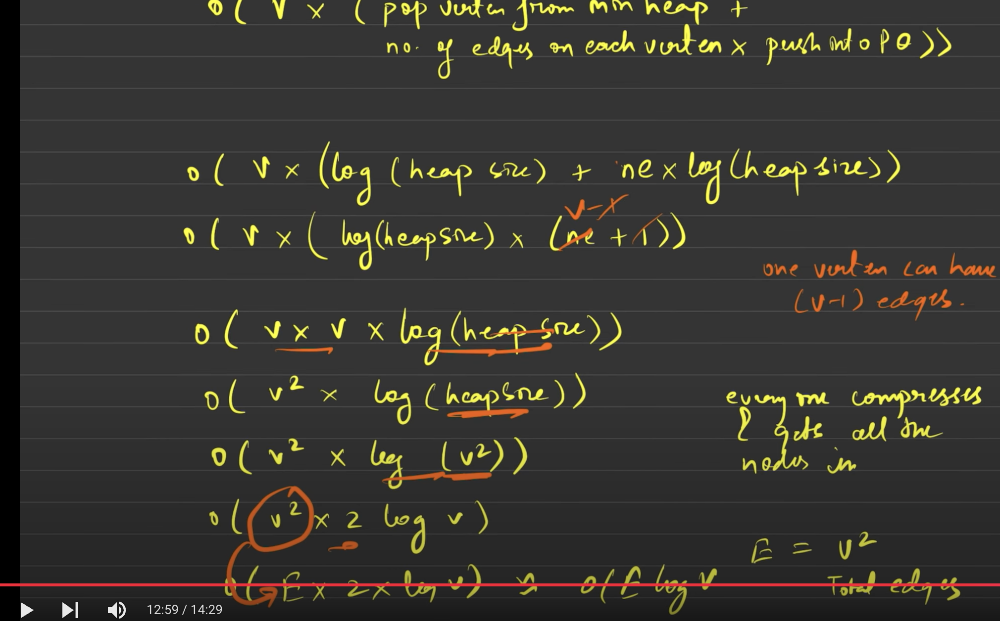

# Dijkstra Algorithm
 - dijkstra alorithm is not applicable for negative weight
 - priority queue is better choice than queue because Using a regular queue in Dijkstra is like handling emergency patients in the order they walked in, not based on how critical they are. A priority queue is like triage — treat the most critical case first.
* time complexity analysis
   O(E*log(v))

