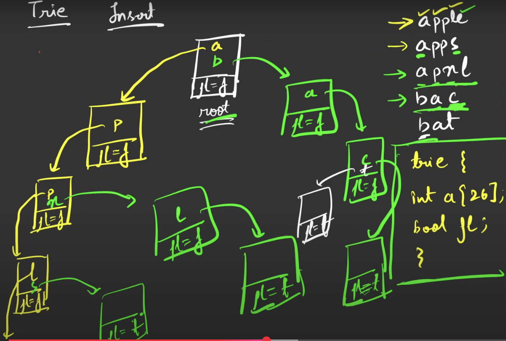

## Trie
https://leetcode.com/problems/implement-trie-prefix-tree/description/


```cpp
#include <bits/stdc++.h>
using namespace std;

class TrieNode
{
  public:
    // Array for children nodes of each node
    TrieNode *children[26];

    // for end of word
    bool isLeaf;

    TrieNode()
    {
        isLeaf = false;
        for (int i = 0; i < 26; i++)
        {
            children[i] = nullptr;
        }
    }

};
  // Method to insert a key into the Trie
void insert(TrieNode *root, const string &key)
{

    // Initialize the curr pointer with the root node
    TrieNode *curr = root;

    // Iterate across the length of the string
    for (char c : key)
    {

        // Check if the node exists for the
        // current character in the Trie
        if (curr->children[c - 'a'] == nullptr)
        {

            // If node for current character does
            // not exist then make a new node
            TrieNode *newNode = new TrieNode();

            // Keep the reference for the newly
            // created node
            curr->children[c - 'a'] = newNode;
        }

        // Move the curr pointer to the
        // newly created node
        curr = curr->children[c - 'a'];
    }

    // Mark the end of the word
    curr->isLeaf = true;
}

// Method to search a key in the Trie
bool search(TrieNode *root, const string &key)
{

    if (root == nullptr)
    {
        return false;
    }

    // Initialize the curr pointer with the root node
    TrieNode *curr = root;

    // Iterate across the length of the string
    for (char c : key)
    {

        // Check if the node exists for the
        // current character in the Trie
        if (curr->children[c - 'a'] == nullptr)
            return false;

        // Move the curr pointer to the
        // already existing node for the
        // current character
        curr = curr->children[c - 'a'];
    }

    // Return true if the word exists
    // and is marked as ending
    return curr->isLeaf;
}

// Method to check if a prefix exists in the Trie
bool isPrefix(TrieNode *root, const string &prefix)
{
    // Initialize the curr pointer with the root node
    TrieNode *curr = root;

    // Iterate across the length of the prefix string
    for (char c : prefix)
    {
        // Check if the node exists for the current character in the Trie
        if (curr->children[c - 'a'] == nullptr)
            return false;

        // Move the curr pointer to the already existing node
        // for the current character
        curr = curr->children[c - 'a'];
    }

    // If we reach here, the prefix exists in the Trie
    return true;
  }
int main()
{

    // Create am example Trie
    TrieNode *root = new TrieNode();
    vector<string> arr = {"and", "ant", "do", "dad"};
    for (const string &s : arr)
    {
        insert(root, s);
    }

    // One by one search strings
    vector<string> searchKeys = {"do", "gee", "bat"};
    for (string &s : searchKeys){
        
        if(search(root, s))
            cout << "true ";
        else
            cout << "false ";
    } 
    cout<<"\n";

    // One by one search for prefixes
    vector<string> prefixKeys = {"ge", "ba", "do", "de"};
    for (string &s : prefixKeys){
        
        if (isPrefix(root, s))
            cout << "true ";
        else
            cout << "false ";
    }

    return 0;
}

Operation	Time Complexity
Insertion:	O(n) Here n is the length of the string inserted
Searching:	O(n) Here n is the length of the string searched
Prefix Searching :O(n) Here n is the length of the string searched
```

Q. ​​Design a data structure that supports adding new words and finding if a string matches any previously added string.

Implement the WordDictionary class:

WordDictionary() Initializes the object.
void addWord(word) Adds word to the data structure, it can be matched later.
bool search(word) Returns true if there is any string in the data structure that matches word or false otherwise. word may contain dots '.' where dots can be matched with any letter.


Example:

Input
["WordDictionary","addWord","addWord","addWord","search","search","search","search"]
[[],["bad"],["dad"],["mad"],["pad"],["bad"],[".ad"],["b.."]]
Output
[null,null,null,null,false,true,true,true]

Explanation
WordDictionary wordDictionary = new WordDictionary();
wordDictionary.addWord("bad");
wordDictionary.addWord("dad");
wordDictionary.addWord("mad");
wordDictionary.search("pad"); // return False
wordDictionary.search("bad"); // return True
wordDictionary.search(".ad"); // return True
wordDictionary.search("b.."); // return True

```cpp
#include <iostream>
#include <unordered_map>
#include <string>
using namespace std;

class Node {
public:
    unordered_map<char, Node*> child;
    bool isEnd;

    Node() {
        isEnd = false;
    }
};

class WordDictionary {
private:
    Node* root;

    bool dfs(const string& word, int index, Node* node) {
        if (index == word.size()) {
            return node->isEnd;
        }

        char ch = word[index];
        if (ch == '.') {
            for (auto& entry : node->child) {
                if (dfs(word, index + 1, entry.second)) {
                    return true;
                }
            }
            return false;
        } else {
            if (node->child.find(ch) == node->child.end()) {
                return false;
            }
            return dfs(word, index + 1, node->child[ch]);
        }
    }

public:
    WordDictionary() {
        root = new Node();
    }

    void addWord(const string& word) {
        Node* node = root;
        for (char ch : word) {
            if (node->child.find(ch) == node->child.end()) {
                node->child[ch] = new Node();
            }
            node = node->child[ch];
        }
        node->isEnd = true;
    }

    bool search(const string& word) {
        return dfs(word, 0, root);
    }
};

int main() {
    WordDictionary wordDictionary;
    wordDictionary.addWord("bad");
    wordDictionary.addWord("dad");
    wordDictionary.addWord("mad");

    cout << boolalpha << wordDictionary.search(".ad") << endl;  // true
    cout << boolalpha << wordDictionary.search("bad") << endl;  // true
    cout << boolalpha << wordDictionary.search("b..") << endl;  // true
    cout << boolalpha << wordDictionary.search("pad") << endl;  // false

    return 0;
}

```

Q. Implement "TRIE” data structure from scratch with the following functions.

Trie(): Initialize the object of this “TRIE” data structure.
insert(“WORD”): Insert the string “WORD” into this “TRIE” data structure.
countWordsEqualTo(“WORD”): Return how many times this “WORD” is present in this “TRIE”.
countWordsStartingWith(“PREFIX”): Return how many words are there in this “TRIE” that have the string “PREFIX” as a prefix.
erase(“WORD”): Delete one occurrence of the string “WORD” from the “TRIE”.

Examples:
Input : ["Trie", "insert", "countWordsEqualTo", "insert", "countWordsStartingWith", "erase", "countWordsStartingWith"]

[ [], ["apple"], ["apple"], ["app"], ["app"], ["apple"], ["app"] ]


Output : [null, null, 1, null, 2, null, 1]


Explanation :

Trie trie = new Trie()

trie.insert("apple")

trie.countWordsEqualTo("apple")  // return 1

trie.insert("app") 

trie.countWordsStartingWith("app") // return 2

trie.erase("apple")

trie.countWordsStartingWith("app")   // return 1

Input : ["Trie", "insert", "countWordsEqualTo", "insert", "erase", "countWordsStartingWith"]

[ [], ["mango"], ["apple"], ["app"], ["app"], ["mango"] ]


Output : [null, null, 0, null, null, 1]


Explanation :

Trie trie = new Trie()

trie.insert("mango")

trie.countWordsEqualTo("apple")  // return 0

trie.insert("app") 

trie.erase("app")

trie.countWordsStartingWith("mango") // return 1

```cpp
#include <iostream>
#include <vector>
using namespace std;

class TrieNode {
public:
    TrieNode* links[26] = {nullptr};
    int prefixCount = 0;   // Count of words sharing this prefix
    int wordEndCount = 0;  // Count of exact word endings here

    bool containsKey(char ch) {
        return links[ch - 'a'] != nullptr;
    }

    void put(char ch, TrieNode* node) {
        links[ch - 'a'] = node;
    }

    TrieNode* get(char ch) {
        return links[ch - 'a'];
    }
};

class Trie {
private:
    TrieNode* root;

public:
    Trie() {
        root = new TrieNode();
    }

    void insert(string word) {
        TrieNode* node = root;
        for (char ch : word) {
            if (!node->containsKey(ch)) {
                node->put(ch, new TrieNode());
            }
            node = node->get(ch);
            node->prefixCount++;
        }
        node->wordEndCount++;
    }

    int countWordsEqualTo(string word) {
        TrieNode* node = root;
        for (char ch : word) {
            if (!node->containsKey(ch)) return 0;
            node = node->get(ch);
        }
        return node->wordEndCount;
    }

    int countWordsStartingWith(string prefix) {
        TrieNode* node = root;
        for (char ch : prefix) {
            if (!node->containsKey(ch)) return 0;
            node = node->get(ch);
        }
        return node->prefixCount;
    }

    void erase(string word) {
        if (countWordsEqualTo(word) == 0) return;

        TrieNode* node = root;
        for (char ch : word) {
            TrieNode* next = node->get(ch);
            next->prefixCount--;
            node = next;
        }
        node->wordEndCount--;
    }
};

```